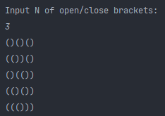

# 1. Task - Brackets

Если мы из корректно записанного арифметического выражения, содержащего числа, знаки операций и открывающие и закрывающие круглые скобки выбросим числа и знаки операций, а затем запишем оставшиеся в выражении скобки без пробелов между ними, то полученный результат назовем правильным скобочным выражением [скобочное выражение `(()(()))` - правильное, а `()(` и `())(` - нет].
Найти число правильных скобочных выражений, содержащих N открывающихся и N закрывающихся скобок. N вводится с клавиатуры. N неотрицательное целое число.

Пример:
N =  1 (по одной скобке открывающейся и закрывающейся) - ответ 1
```
()
)(
))
((
```
Только один правильный вариант

Для введенного числа 2 - 2 :
```
()()
(())
```
То есть только два варианта, когда все открытые скобки правильно открываются/закрываются.
И так далее.

Мой пример: 





# 2. Task - Sum Of Digits In Factorial.

Find the sum of the digits in the number 100! (i.e. 100 factorial) 
{Correct answer: 648}

Мой пример:


# 3. Task - The Shorted Path.

You are given a list of cities. Each direct connection between two cities has its transportation cost (an integer bigger than `0`). The goal is to find the paths of minimum cost between pairs of cities. Assume that the cost of each path (which is the sum of costs of all direct connections belonging to this path) is at most `200000`. The name of a city is a string containing characters `a,...,z` and is at most 10 characters `long`.

### **Input:**
```
s [the number of tests <= 10]
n [the number of cities <= 10000]
NAME [city name]
p [the number of neighbors of city NAME]
nr cost [nr - index of a city connected to NAME (the index of the first city is 1)]
           [cost - the transportation cost]
r [the number of paths to find <= 100]
NAME1 NAME2 [NAME1 - source, NAME2 - destination]
[empty line separating the tests]

```

### **Output:**

```
cost [the minimum transportation cost from city NAME1 to city NAME2 (one per line)]
```

### **Example:**

#### Input:

```java
1
4
gdansk
2
2 1
3 3
bydgoszcz
3
1 1
3 1
4 4
torun
3
1 3
2 1
4 1
warszawa
2
2 4
3 1
2
gdansk warszawa
bydgoszcz warszawa
```
#### Output:

```java
3
2
```
***
## My Example:

```java
Enter s — [the number of tests <= 10].
1
Enter n — [the number of cities <= 10000].
4
Enter NAME_1 city.
gdansk
Enter p [the number of neighbors of city NAME]. 
2
Enter nr cost - [nr - index of a city connected to NAME (the index of the first city is 1)][cost - the transportation cost].
2 1
Enter nr cost - [nr - index of a city connected to NAME (the index of the first city is 1)][cost - the transportation cost].
3 3
Enter NAME_2 city.
bydgoszcz
Enter p [the number of neighbors of city NAME]. 
3
Enter nr cost - [nr - index of a city connected to NAME (the index of the first city is 1)][cost - the transportation cost].
1 1
Enter nr cost - [nr - index of a city connected to NAME (the index of the first city is 1)][cost - the transportation cost].
3 1
Enter nr cost - [nr - index of a city connected to NAME (the index of the first city is 1)][cost - the transportation cost].
4 4
Enter NAME_3 city.
torun
Enter p [the number of neighbors of city NAME]. 
3
Enter nr cost - [nr - index of a city connected to NAME (the index of the first city is 1)][cost - the transportation cost].
1 3
Enter nr cost - [nr - index of a city connected to NAME (the index of the first city is 1)][cost - the transportation cost].
2 1
Enter nr cost - [nr - index of a city connected to NAME (the index of the first city is 1)][cost - the transportation cost].
4 1
Enter NAME_4 city.
warszawa
Enter p [the number of neighbors of city NAME]. 
2
Enter nr cost - [nr - index of a city connected to NAME (the index of the first city is 1)][cost - the transportation cost].
2 4
Enter nr cost - [nr - index of a city connected to NAME (the index of the first city is 1)][cost - the transportation cost].
3 1
Enter r [the number of paths to find <= 100].
2
Enter NAME1 NAME2 - [sourceCity destinationCity].
gdansk warszawa
Enter NAME1 NAME2 - [sourceCity destinationCity].
bydgoszcz warszawa
3
2

Process finished with exit code 0

```

